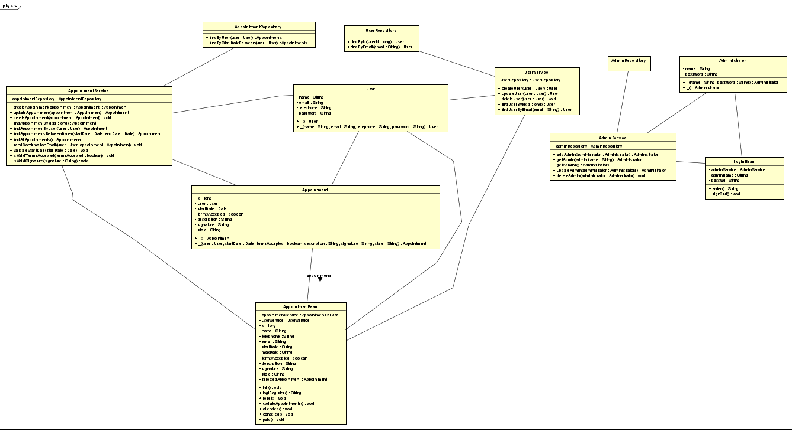

# PROYECTO FINAL CVDS
> Hecho por:
>
>> 1. Juan Sebastian Cepeda Saray
>> 2. Santiago Forero Yate
>> 3. Sergio Andres Gonzales Vargas
>> 4. Nicolas Castro
>
> Equipo Scrum AIRETUPAL DEVS
> 
> Sistema de agendamiento de citas para la empresa HALS
>> - Modelo de clases del aplicativo
>> 
>> - Modelo de Datos
>>
>> 
>